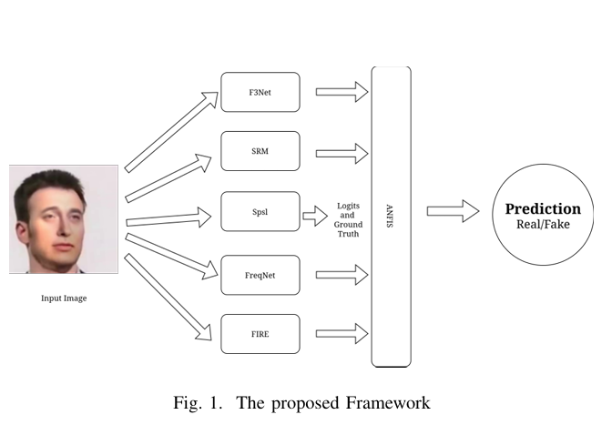

# Neuro-Fuzzy Fusion for Dataset-Agnostic Deepfake Detection

Official implementation of the paper:

**Position Paper: Neuro-Fuzzy Fusion for Dataset-Agnostic Deepfake Detection**

**Authors**

- Soumyadeep Chattopadhyay
- Bhoomi Priya
- Pranab K. Muhuri

Department of Computer Science and Engineering  
South Asian University, New Delhi, India

**Accepted at IEEE International Conference on Fuzzy Systems (FUZZ), WCCI 2026**

---

## Overview

Deepfake detectors often achieve high performance on the datasets they are trained on but struggle to generalize to manipulations generated by unseen methods. Additionally, many existing approaches provide little insight into *why* a particular prediction is made.

This repository presents a neuro-fuzzy decision fusion framework that combines the outputs of multiple complementary deepfake detectors using an **Adaptive Neuro-Fuzzy Inference System (ANFIS)**. Instead of relying on a single detector, the framework learns to fuse detector confidence scores into a single interpretable prediction.

The project is designed around a **Leave-One-Manipulation-Out (LOMO)** evaluation protocol to study cross-dataset generalization.

---

## Method Overview

The proposed pipeline consists of two stages.

1. Multiple deepfake detectors independently produce prediction scores (logits).
2. These logits are fused using an ANFIS model that learns fuzzy decision rules for final classification.

```
<p align="center">
  
</p>

> Replace `assets/architecture.png` with your architecture figure.

## Repository Structure

```
ANFIS/
│
├── logits/                     # Input detector logits
│
├── output/                     # Comparison experiment outputs
│
├── output_anfis/               # ANFIS experiment outputs
│
├── src/
│   ├── shared/
│   │   ├── config.py
│   │   ├── data_loader.py
│   │   ├── metrics.py
│   │   └── utils.py
│   │
│   ├── comparison/
│   │   ├── models.py
│   │   ├── ensembles.py
│   │   ├── experiment.py
│   │   └── main.py
│   │
│   └── anfis/
│       ├── anfis_models.py
│       ├── experiment.py
│       └── main.py
│
├── run_comparison.py
├── run_anfis.py
|__ rule.py  #Helps generate if then rules from the final ANFIS Model
└── README.md
```

---

## Features

- Modular implementation
- Neuro-fuzzy decision fusion
- Leave-One-Manipulation-Out evaluation
- Traditional ML baselines
- Ensemble baselines
- Automated hyperparameter tuning with Optuna
- Reproducible experimental pipeline
- Saved preprocessing pipelines and trained models

---

## Installation

Clone the repository.

```bash
git clone https://github.com/<username>/<repository>.git

cd <repository>
```

Install dependencies.

```bash
pip install -r requirements.txt
```

or

```bash
pip install numpy pandas scikit-learn xgboost optuna xanfis
```

---

## Running the Comparison Experiment

```bash
python run_comparison.py
```

This evaluates:

- Mean Averaging
- Weighted Averaging
- Majority Voting
- Logistic Regression
- XGBoost

Outputs are saved in:

```
output/
```

---

## Running the ANFIS Experiment

```bash
python run_anfis.py
```

Outputs are saved in:

```
output_anfis/
```

---

## Configuration

Most experiment settings are defined in

```
src/shared/config.py
```

including

- datasets
- random seed
- hyperparameter ranges
- validation split
- Optuna search settings

---

## Outputs

The comparison pipeline produces

- model predictions
- trained model bundles
- evaluation metrics

The ANFIS pipeline produces

- trained ANFIS models
- prediction files
- experiment outputs

---

## Citation

If you use this work in your research, please cite

```bibtex
@inproceedings{chattopadhyay2026neurofuzzy,
  title={Neuro-Fuzzy Fusion for Dataset-Agnostic Deepfake Detection},
  author={Chattopadhyay, Soumyadeep and Priya, Bhoomi and Muhuri, Pranab K.},
  booktitle={IEEE International Conference on Fuzzy Systems (FUZZ)},
  year={2026}
}
```

*(Citation will be updated once the proceedings are available.)*


## Acknowledgements

We thank the Department of Computer Science and Engineering, South Asian University, for supporting this research.

---

## Contact

For questions regarding this work, please contact:

**Bhoomi Priya**

Department of Computer Science and Engineering

South Asian University

New Delhi, India

Email: bhoomipriya@students.sau.ac.in